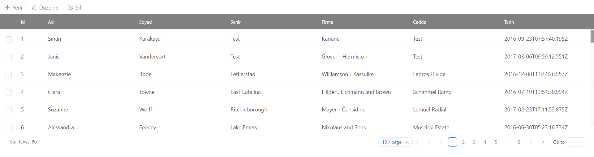
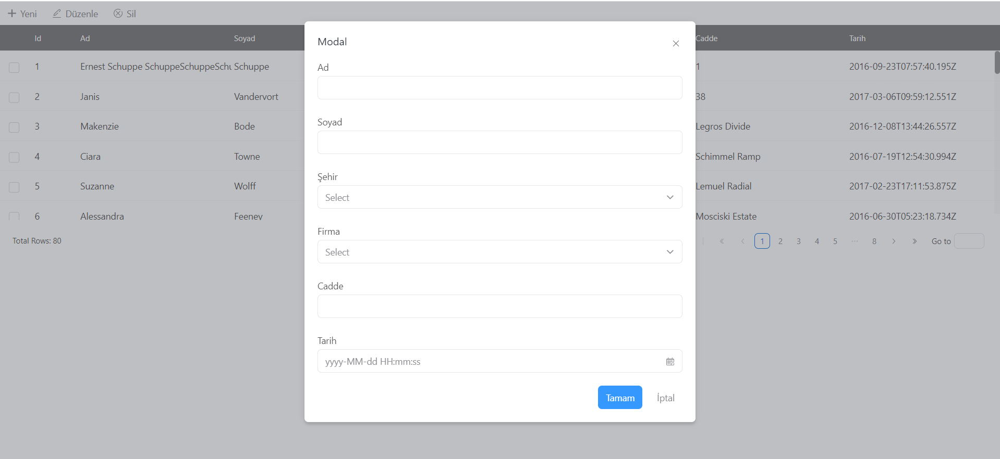
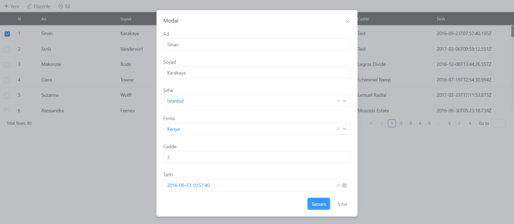

# eria-data-tool

> Makes it easy to create forms

[](https://www.npmjs.com/package/eria-data-tool) [](https://standardjs.com)

## Install

```bash
npm install --save eria-data-tool
```

# Intro

This component aims to provide a ready-made structure to perform standard crud operations.The links of the crud operations to be made are given to this component and the saving, updating and deletion operations are performed.
Built on [rsuite](https://github.com/rsuite/rsuite) as infrastructure.

# Feature

- Create save form based on data properties

- Create update form based on data properties

- You can assign data types to fields in the form

- You can customize the fields in the table with the render function

## Usage

You need to specify the row detail as follows

### Define Row Properties

```js
const row = [
  {
    key: 'id',
    label: 'Id',
    fixed: true,
    width: 70,
    id: true,
    type: 'text',
    render: (item) => {
      return <span>{item.id}</span>
    }
  },
  {
    key: 'firstName',
    label: 'Ad',
    flexGrow: 1,
    type: 'text'
  },
  {
    key: 'lastName',
    label: 'Soyad',
    type: 'text',
    flexGrow: 1
  },
  {
    key: 'city',
    label: 'Şehir',
    type: 'select',
    flexGrow: 1,
    options: [
      { value: '38', label: 'Kayseri' },
      { value: '06', label: 'Ankara' },
      { value: '34', label: 'İstanbul' },
      { value: '35', label: 'İzmir' },
      { value: '01', label: 'Adana' }
    ]
  },
  {
    key: 'companyName',
    label: 'Firma',
    type: 'select',
    remote:
      'https://raw.githubusercontent.com/rsuite/rsuite/main/docs/public/data/users-role.json',
    flexGrow: 1
  },
  {
    key: 'street',
    label: 'Cadde',
    flexGrow: 1,
    type: 'number'
  },
  {
    key: 'date',
    label: 'Tarih',
    flexGrow: 1,
    type: 'dateTime'
  }
]
```

### Example

```jsx
import { EriaTable } from 'eria-data-tool'

function Example() {
  return (
    <EriaTable
      data={data}
      row={row}
      update={true}
      save={true}
      remove={true}
      pagination={true}
      remotePagination={true}
      totalPageCountUrl='http://localhost/api/count.json'
      listItemUrl='http://localhost/api/row.json'
      saveItemUrl='https://localhost/save'
      updateItemUrl='https://localhost/update'
      removeItemUrl='https://localhost/delete'
      onRowClick={(item) => {
        console.log(item)
      }}
      beforeSave={(item) => {
        return item
      }}
      afterSave={(item) => {
        console.log(item)
      }}
      beforeUpdate={(item) => {
        return item
      }}
      afterUpdate={(item) => {
        console.log(item)
      }}
      beforeDelete={(item) => {
        return item
      }}
      afterDelete={(item) => {
        console.log(item)
      }}
    />
  )
}
```

## Props

| Property          | Type       | Description                                                                                                                    |
| ----------------- | ---------- | ------------------------------------------------------------------------------------------------------------------------------ |
| row               | JSON Array | You define the properties of the data that make up the table                                                                   |
| data              | JSON Array | You can manually assign the data that make up the table here                                                                   |
| save              | boolean    | Save operation permission                                                                                                      |
| update            | boolean    | Update operation permission                                                                                                    |
| delete            | boolean    | Delete operation permission                                                                                                    |
| pagination        | boolean    | Show pagination                                                                                                                |
| remotePagination  | boolean    | If this feature is active, limit and page parameters are sent at the end of the request.                                       |
| totalPageCountUrl | string     | Required for pagination in the table. When you want the total number of records, it should be returned as {totalCount:0}.      |
| listItemUrl       | string     | The link to request the data whose properties we have specified in the row field                                               |
| saveItemUrl       | string     | The address to which the data filled in the saving form will be sent with the post request                                     |
| updateItemUrl     | string     | The address to which the data filled in the updating form will be sent with the put                                            |
| removeItemUrl     | string     | When the data is desired to be deleted, the address to which the delete request will be sent by adding the id field to the end |

## Methods

| Method       | Description                                                               |
| ------------ | ------------------------------------------------------------------------- |
| onRowClick   | Clicking on any row returns its data                                      |
| beforeSave   | Returns the final version of the record to make changes before the save   |
| afterSave    | Returns the response to the request for save                              |
| beforeUpdate | Returns the final version of the record to make changes before the update |
| afterUpdate  | Returns the response to the request for update                            |
| beforeDelete | Returns the final version of the record to make changes before the delete |
| afterDelete  | Returns the response to the request for delete                            |

## Screenshots





## License

MIT © [sinankarakaya](https://github.com/sinankarakaya)
